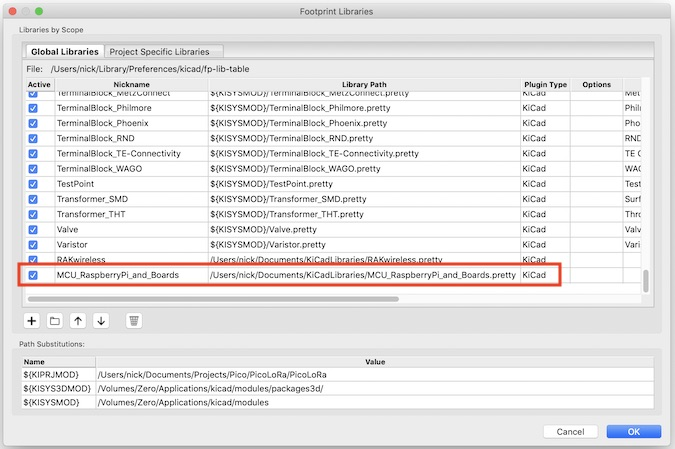

# Install KiCad libraries

## Manage Symbol Libraries

Accessed from the Preferences menu, add a new line with the +, give it a name and use the folder icon to point to the directory/folder where you have KiCadLibraries.

## Manage Footprint Libraries

Ditto! Accessed from the Preferences menu, add a new line with the +, give it a name and use the folder icon to point to the directory/folder where you have KiCadLibraries.

