# Mai Pico - Maimai Style Mini Controller
[点这里可以切换到中文版](README_CN.md)

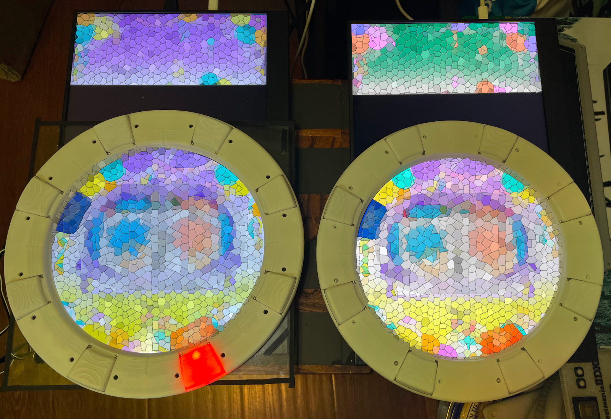  
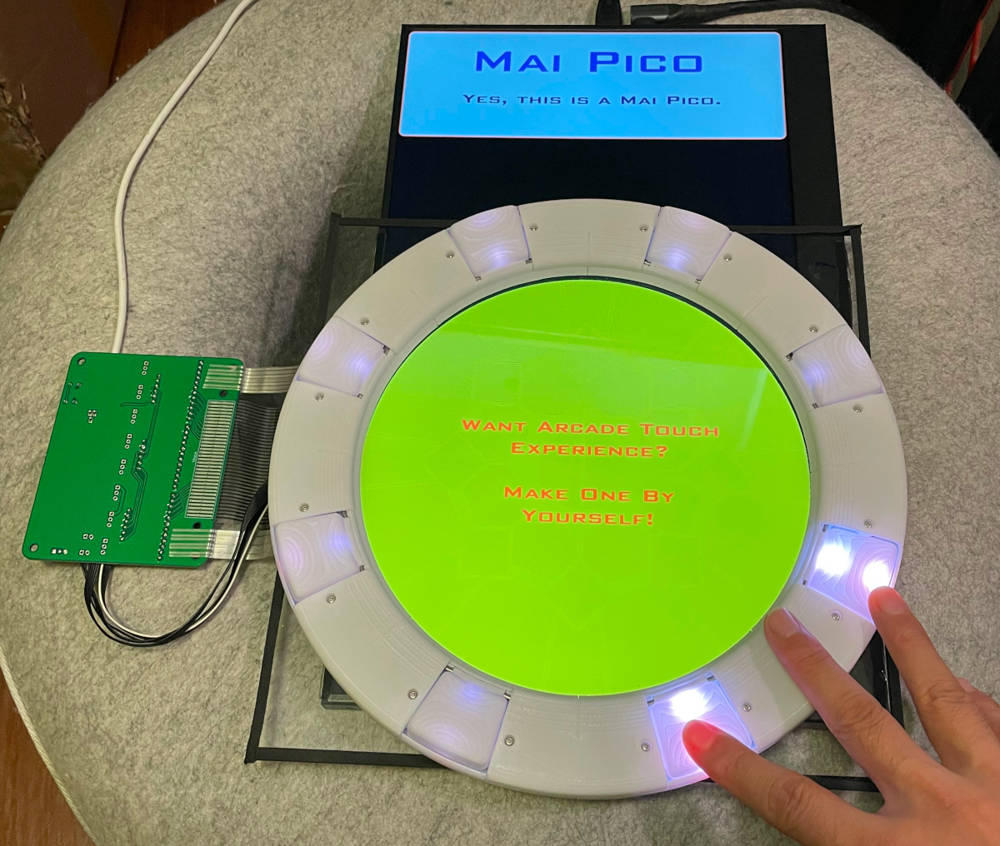

**Features:**
* Made with a 15.6 inch portable screen.
* Arcade-like experience.
* Dual-player is possible.
* Built-in AIME support.
* All source files open.

Thanks to many respectful guys/companies who made their tools or materials free or open source (KiCad, OnShape, InkScape, Raspberry things, JLCPCB), and also:
* RP_Silicon_KiCad: https://github.com/HeadBoffin/RP_Silicon_KiCad
* Switch_Keyboard_Kailh: https://github.com/kiswitch/keyswitch-kicad-library
* Type-C: https://github.com/ai03-2725/Type-C.pretty
* Mai2Touch: https://github.com/Sucareto/Mai2Touch

## Notes
This project is the most complex one among all my projects.
* It needs a custom etched ITO glass and a portable display.
* Heavily depends on 3D printing.
* Requires skills to solder tiny components.
* Requires many other DIY hands-on skills.
* The IO PCB is still in prototype state, it works, but the layout and connectors are not perfect. You may need to solder directly from Pi Pico's pins. I'm just too lazy to release a new version.
* I didn't design the housing, so it's your job to make it look nice and structually stable, follow your imagination and taste.

## About the License
It's CC-NC. So DIY for yourself and for your friend for free, don't make money from it. And plagiarism that doesn’t even dare to mention the original author is not acceptable. Plase note that pooling orders and group buying for raw materials is acceptable. Selling off any leftover components without profit is also acceptable.

If you're interested in buying from me or some kind of commercial use, please contact me (Discord, QQ group, Wechat group or leave your contact in issue section).

## My Discord Invitation
https://discord.gg/M8f2PPQFEA

## My Other Projects
You can check out my other cool projects.

             

* Popn Pico: https://github.com/whowechina/popn_pico
* IIDX Pico: https://github.com/whowechina/iidx_pico
* IIDX Teeny: https://github.com/whowechina/iidx_teeny
* Chu Pico: https://github.com/whowechina/chu_pico
* Mai Pico: https://github.com/whowechina/mai_pico
* Diva Pico: https://github.com/whowechina/diva_pico
* AIC Pico: https://github.com/whowechina/aic_pico
* Groove Pico: https://github.com/whowechina/groove_pico
* Geki Pico: https://github.com/whowechina/geki_pico
* Musec Pico: https://github.com/whowechina/musec_pico
* Ju Pico: https://github.com/whowechina/ju_pico
* Bishi Pico: https://github.com/whowechina/bishi_pico
* Bishi Pico: https://github.com/whowechina/nos_pico

## **Disclaimer** ##
I made this project in my personal time without any sponsorship. I will continue to improve the project. I have done my best to ensure that everything is accurate and functional, there's always a chance that mistakes may occur. I cannot be held responsible for any loss of your time or money that may result from using this open source project. Thank you for your understanding.

## Builds Gallery
Before we start, I want to encourage you with some hobbyist builds.

### **Lavide's Build**
  Lavide made a nice compact all-in-one Mai Pico cab!  
  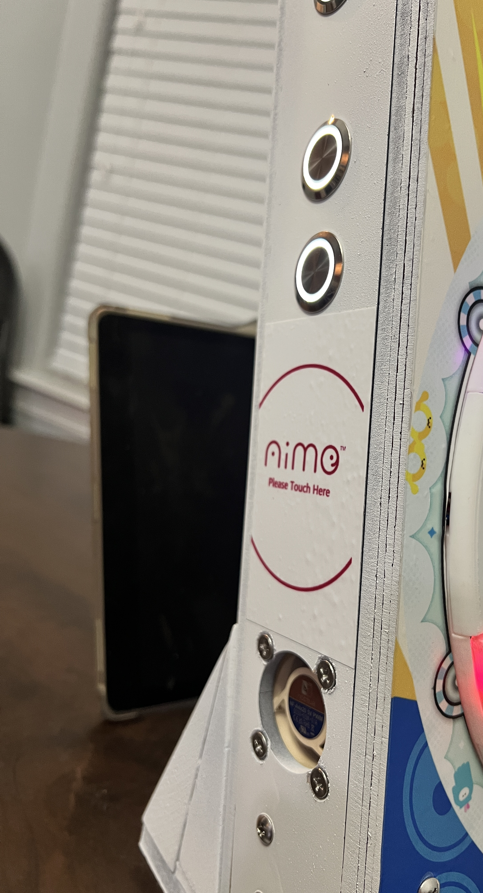

### **Romper's Build**
  Romper made a full-size con using Mai Pico's touch design.  
  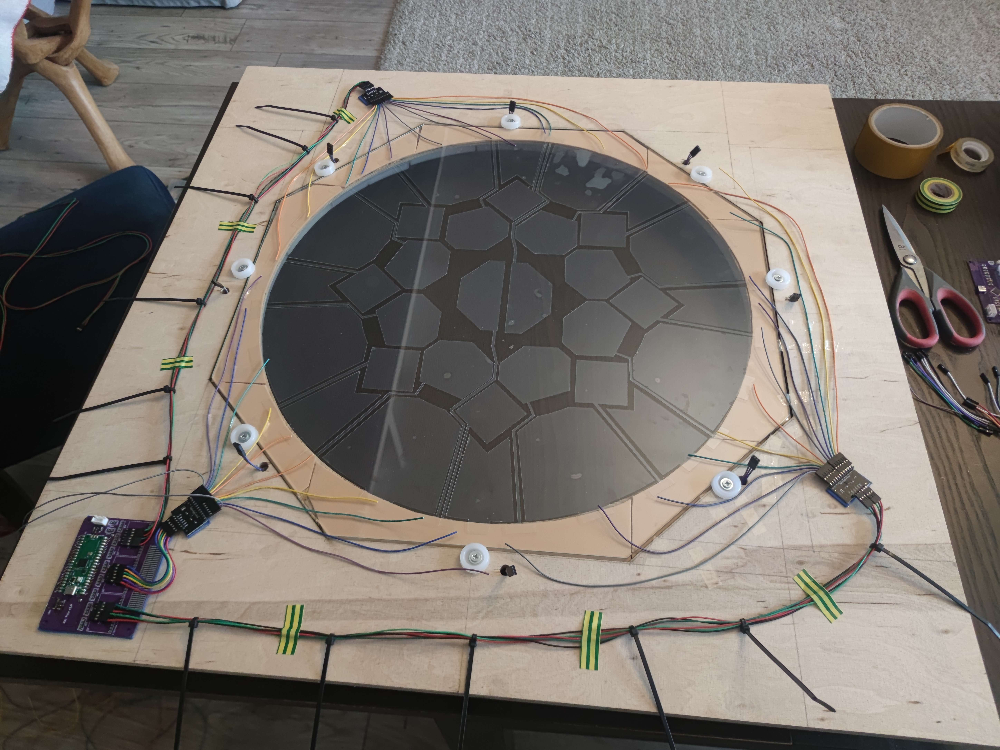  
  Check out his build guide here.  
  https://github.com/ir0nq/maimai-homemade-controller

### **imfrea's Build**
  imfrea designed a nice-looking and inexpensive acrylic housing for Mai Pico.  
  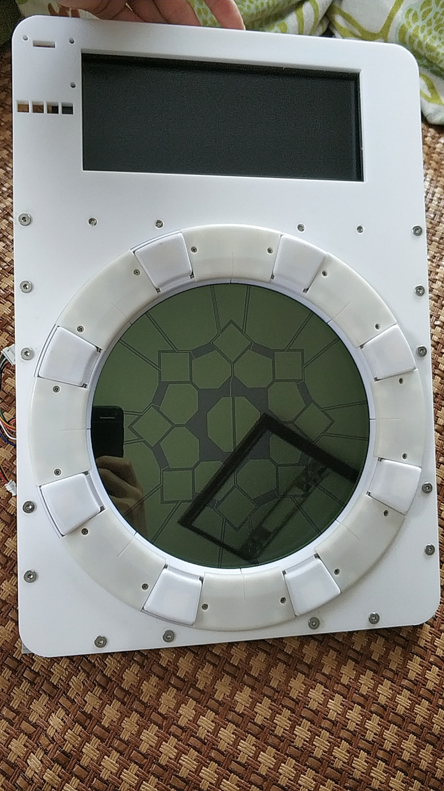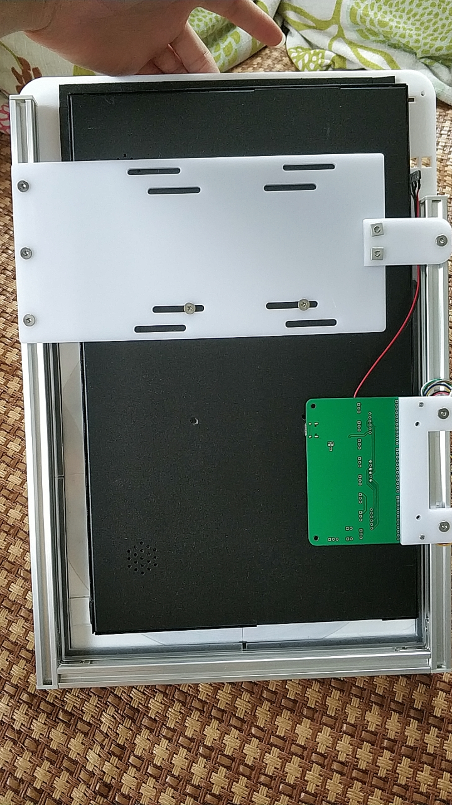  
  You can download the acrylic case designs from his fork of Mai Pico here.  
  https://github.com/imfrea/mai_pico

### ***IlIIllllIlIIlll's Build**
  IlIIllllIlIIlll made another nice and compact housing.  
  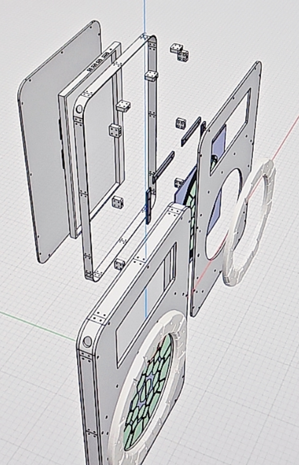 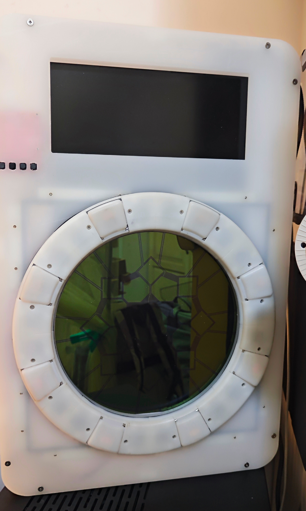 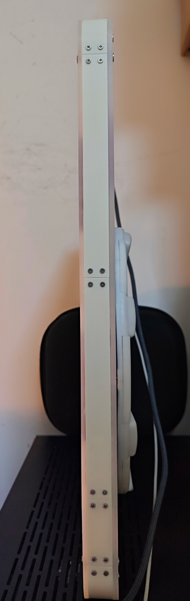 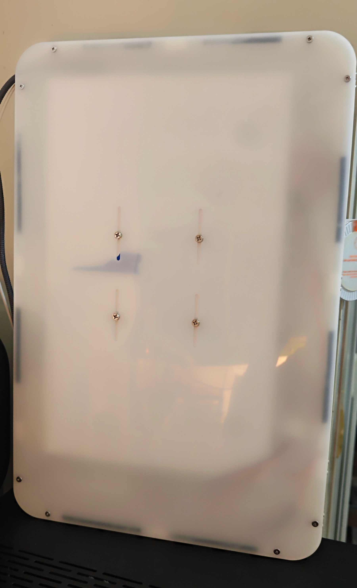  
  Thanks to his/her contribution, you can download the design files directly from this repository. It's located at `Production\3rdparty\IlIIllllIlIIlll_housing.zip`. The panel can be cut from PP or acrylic sheets, and other parts can be 3D printed. Plase note that this design is also not for commercial use.

## HOW TO BUILD
### PCB
* Go JLCPCB and make order with the gerber zip file (latest `Production\PCB\mai_io_v*.zip` and `Production\PCB\mai_button_v*.zip`), regular FR-4 board, 1.6mm thickness. You need 1x io PCB and 8x button PCBs for one Mai Pico con.  
  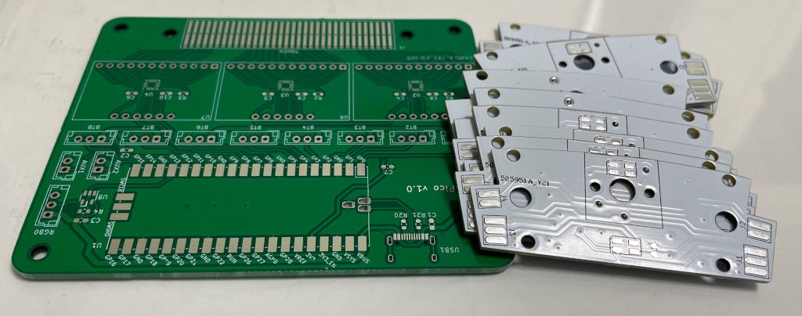
* 1x Rasberry Pico Pi Pico or Pico W.  
  https://www.raspberrypi.com/products/raspberry-pi-pico
  Becareful of 3 pins that are at the other side, they're difficult to solder and may leave air bubbles.  
  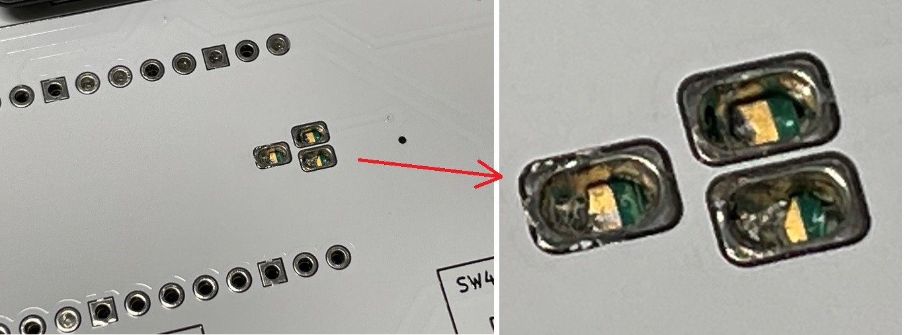
* 1x USB Type-C socket (918-418K2023S40001 or KH-TYPE-C-16P)
* 2x 0603 5.1kohm resistors (R20, R21) for USB. If you plan to use the native USB socket on the Pi Pico directly, then the Type-C socket and resistors can be omitted, making the soldering much simpler.
* 3x MPR121 modules, there're many types in the market, choose ones like this.  
  https://www.sparkfun.com/products/retired/9695  
  Before solder MP121 module to the main PCB board, remember to use a knife to **cut (unshort) the tiny trace that connects ADDR to the GND**. Please be careful not to cut more than necessary.  
  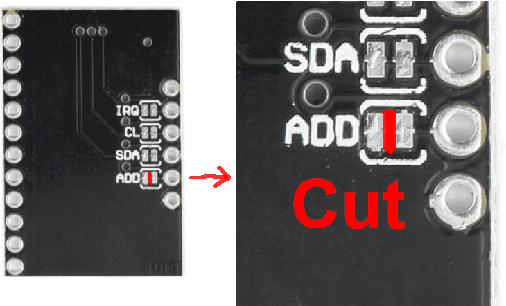
* Leave U5, U6, U7 area discrete components empty as we're using MPR121 module, not the chip.
* 1x SN74LV1T34DBVR (SOT-23-5) level shifter (U8), if you can't find one, use a 0603 10ohm resistor (R4) as an alternative.  
  https://www.lcsc.com/product-detail/Buffer-Driver-Transceiver_Texas-Instruments-SN74LV1T34DBVR_C100024.html
* 4x 0603 1uF (0.1~1uF all fine) capacitors (C1, C2, C3, C7), OPTIONAL, recommended.
* 16x WS2812B-3528 RGB LEDs (each button needs two).
* 8x Kailh Choc v1 key switches, linear, 30gf to 45gf ones.  
  https://www.kailhswitch.com/mechanical-keyboard-switches/low-profile-key-switches/burnt-orange-switch.html
* 1x PN532 NFC module and some thin wires, only needed if you want AIME.  
  https://www.elechouse.com/product/pn532-nfc-rfid-module-v4/  
  You need to solder it to the same I2C as the MPR121 (GPIO 6 and 7).

### ITO Glass
* Find a service to make custom etching ITO coated glass. The AutoCAD file is `Production\CAD\mai_pico_ito_v*.dwg`. Use 2mm thickness, 10-20ohm sheet resistance ITO coated glass.
  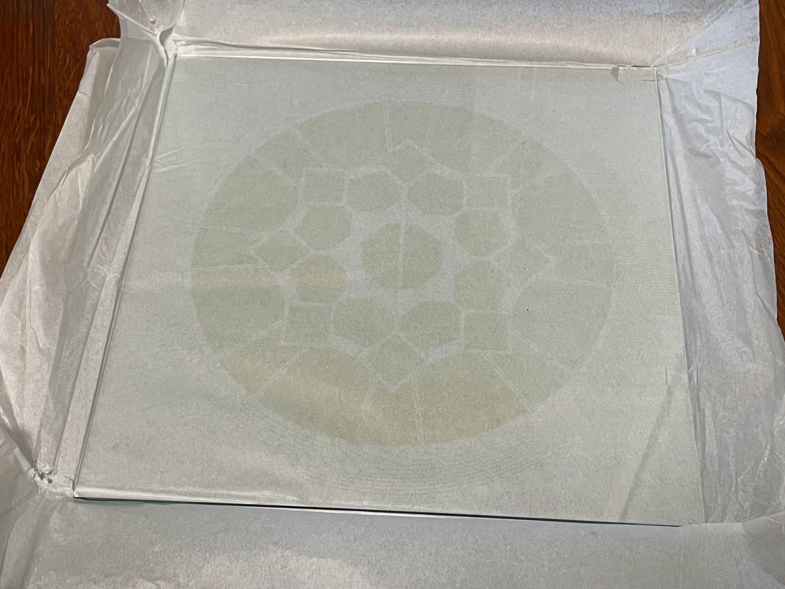
* The ITO coated glass is connected to the IO PCB by "zebra cable" (1.6mm pitch: 0.8mm black part and 0.8mm clear part). A silicon heater head at 200°C is used to stick the zebra cable to the gold finger part of PCB and ITO coated glass. The formal name of this cable is "Heat Seal Connector".  
  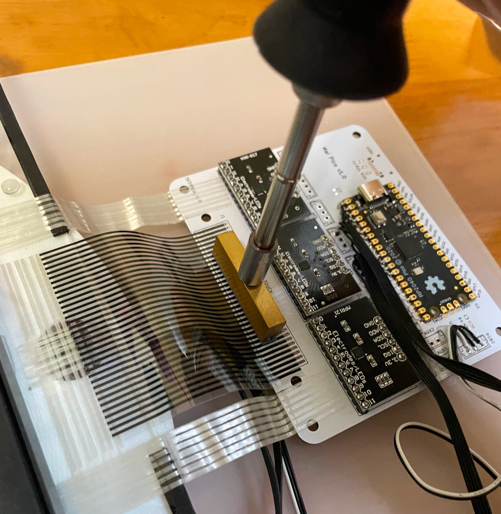
* Custom ITO coated glass is relatively expensive, but ours is small, so it's not like arcade-size expensive. This is the shop I ordered the ITO glass. The minimal batch is around 5 pieces. But they provide service only in China as far as I know.  
  https://shop378788148.taobao.com/?spm=2013.1.1000126.2.305e16c4LFf1GW

### Button Ring
* Print out the 8x set of base, link, button and cover from `Production\3DPrint\mai_*.stl`.
* Buy 8x 2mm (diameter) * 40mm (length) steel shafts, they're used as the button hinge.
* Here's how to assemble them, hinge shaft and components on PCB are not shown in this rendered image.  
  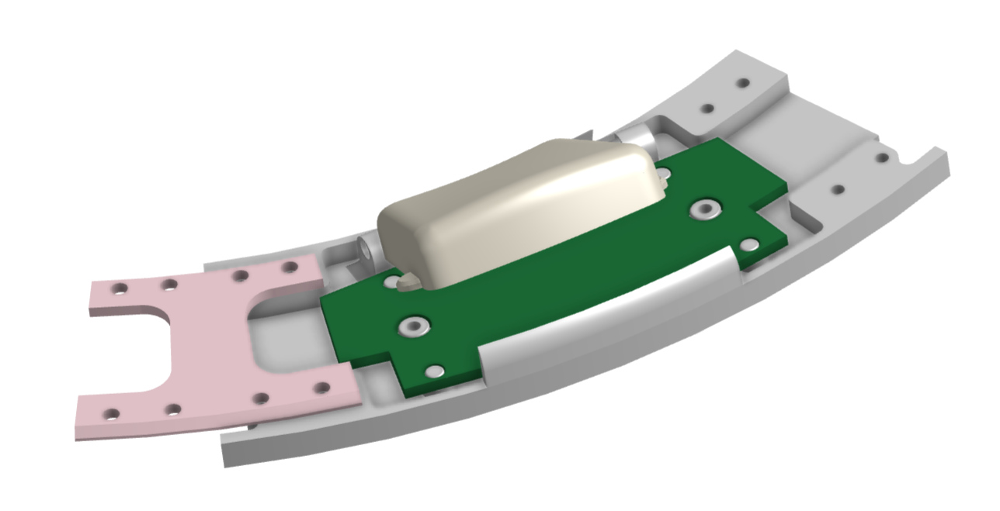
* Here's how I assembled the ring. Please note that wiring for the button switches is missing in these pictures.
  * All discrete components ready.  
    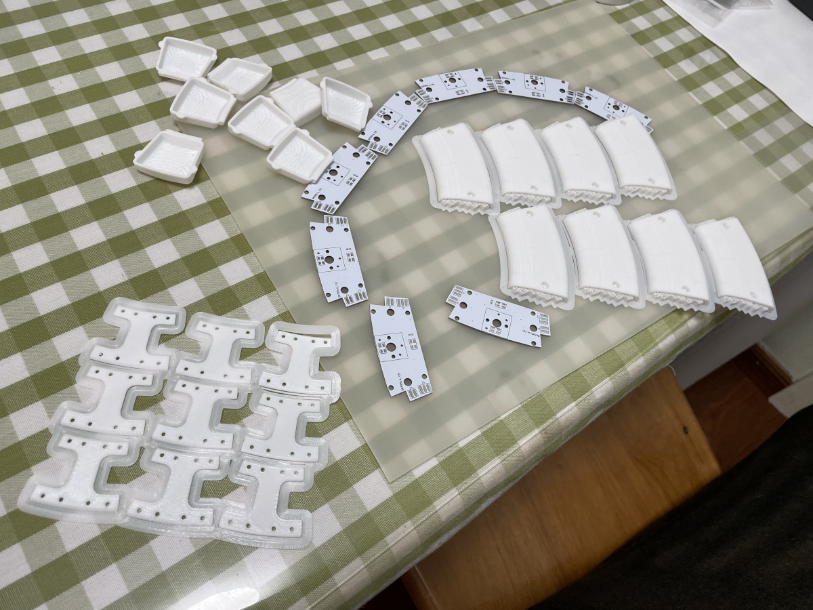
  * Solder the button PCB first.  
    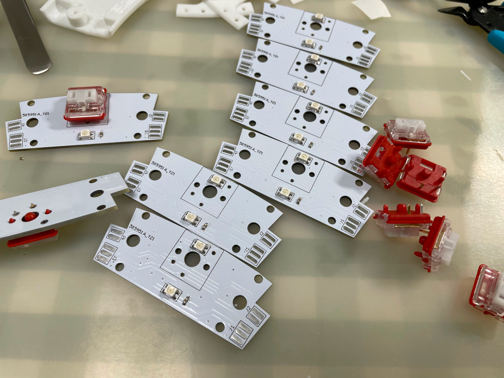
  * Button PCBs are daisy-chained using short and soft 3-wire cable, they're G, IN/OUT, V (GND, Signal In/Out and VCC respectively). RGB signal goes in from "IN" and goes out to the next LED through "OUT". The "Btn" button signal pins are not soldered yet, you can later wire them. Don't worry about the order of button GPIOs, because they can be remapped through command line interface.    
    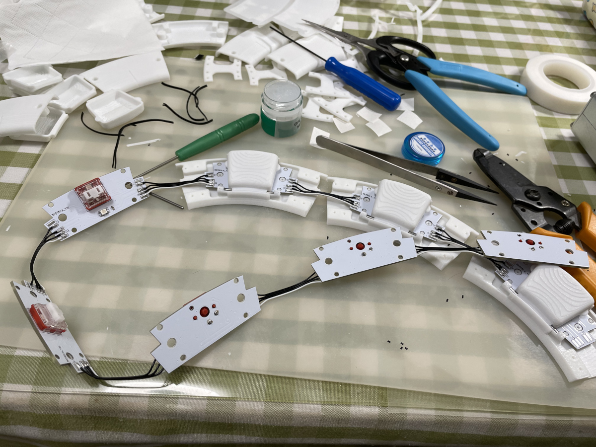
  * You need 3M5423 UHMW film tape (or similar hard and super-smooth PTFE tape with 0.2-0.3 thickness). It is to lubricate the button surface that touches the keyswitch.  
    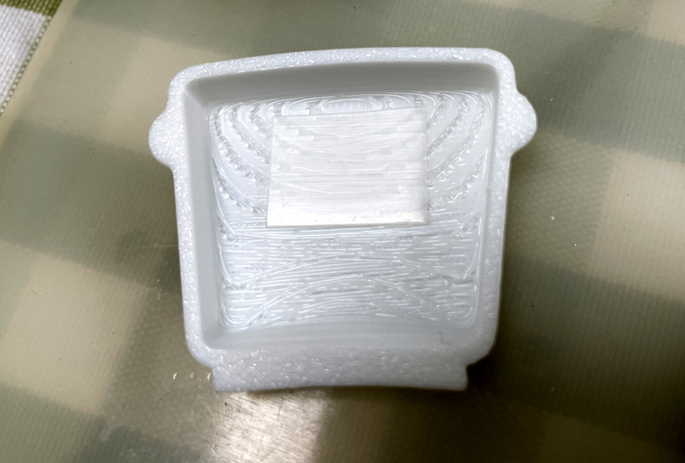
  * Assemble the 3D printed parts together with the PCBs.  
    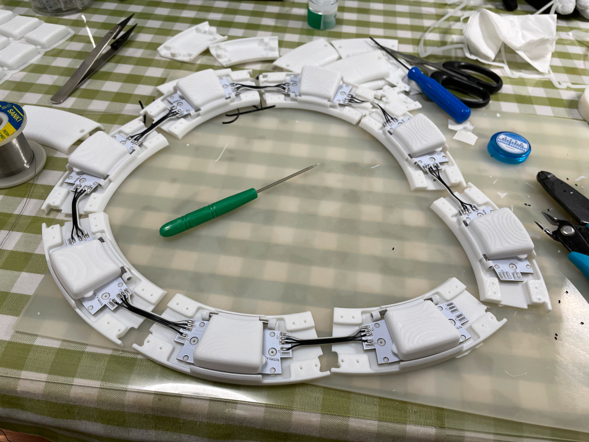
  * Use shaft to expand the support holes a little bit, and apply some keyboard switch lubricant such as Krytox 205G0 to make the shaft super smooth.  
    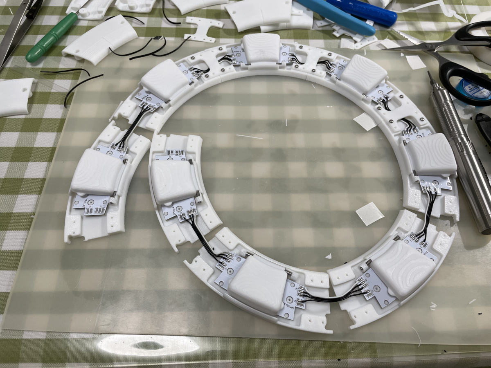
  * Each `link` needs 8x M2*4mm screws to connect two `base`s together.  
    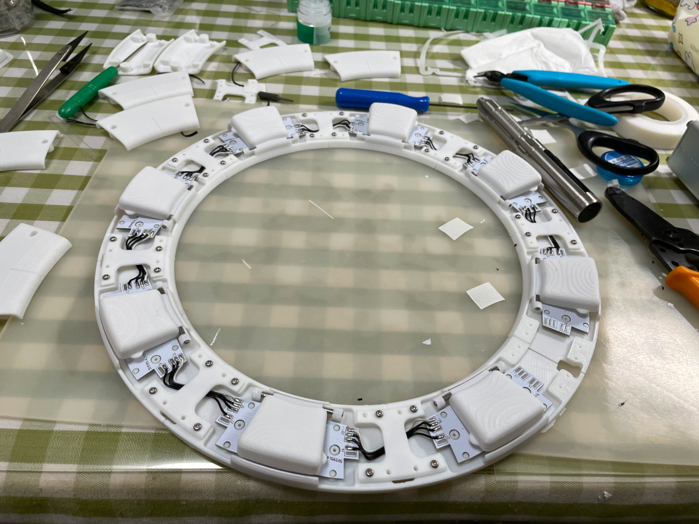
  * Install the cover, each needs 2x M2*5mm screws.  
    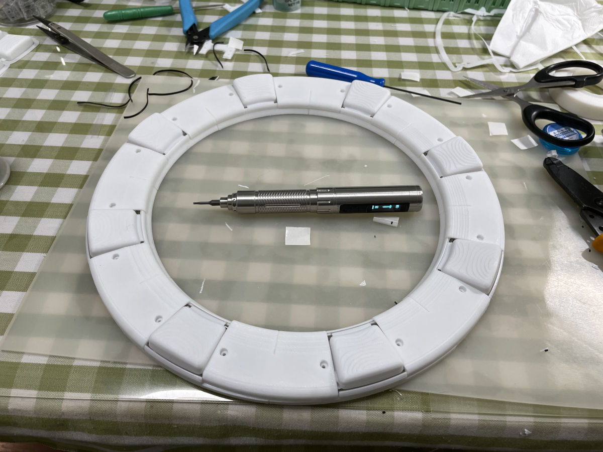

### Portable Display
  * Resolution: 1920*1080, size: 15.6inch, refresh rate: 120Hz (recommended) or 60Hz, built-in speakers.
  * They're easy to find. Choose cheap or even tiny-flawed ones, they're much cheaper and work just fine.
  * There're 2 types of driver board, one is micro-HDMI only and the other supports type-C display (for convenient Nintendo Switch connection). They're both OK.  
  https://www.amazon.com/s?k=portable+display+15.6+120hz&s=price-asc-rank&crid=1CCA2EAYLZDBE&qid=1697276847&sprefix=portable+display+15.6+120hz%2Caps%2C387&ref=sr_st_price-asc-rank&ds=v1%3AqoS0mks05q225yuL8reh50fEEBkTZ583nMPEZJwjXAk

### Glue Things Together
  * I use 3M VHB tape (0.5mm or 1mm thickness) to stick the button ring, the ITO glass and the monitor together.
  * Only use a little tape, I use 4 small pieces to stick ITO glass to the display and another 4 small pieces to stick button ring to the ITO glass.
  * Don't apply the tape on the traces of the ITO glass, you can see the traces or pads at certain angle.

### Housing
  * It's your job to design it and make it look nice.

### Firmware
* UF2 file is in `Production\Firmware` folder.
* For the new build, hold the BOOTSEL button while connect the USB to a PC, there will be a disk named "RPI-RP2" showed up. Drag the UF2 firmware binary file into it. That's it.
* LED and Touch protocols are implemented following Sucareto's research at https://github.com/Sucareto/Mai2Touch.
* It has a command line to do configuration. You can use this Web Serial Terminal to connect to the USB serial port of the Mai Pico. (`?` to display help message.)  
  https://googlechromelabs.github.io/serial-terminal/  
  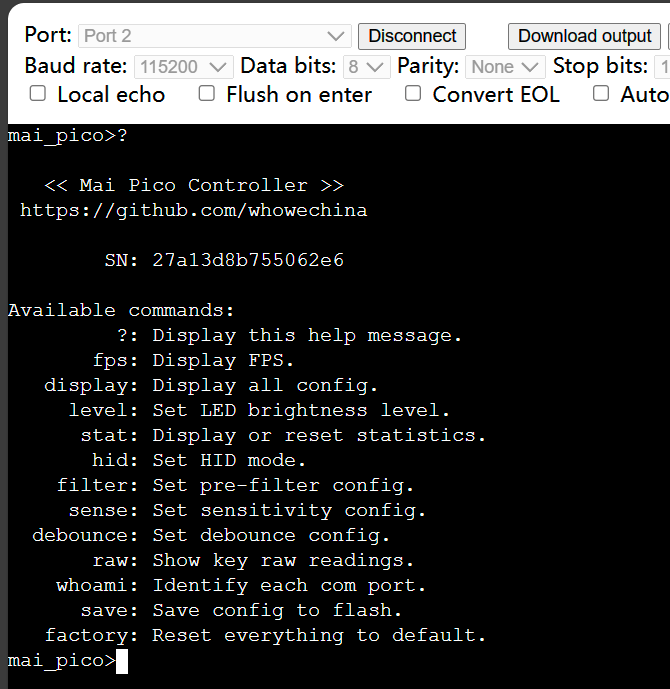
   * Please note that when you click "Connect" button, you'll actually see the name of each port.  
   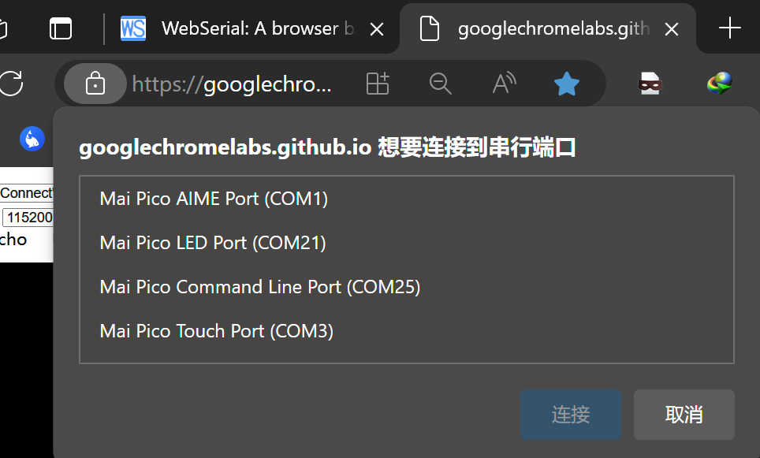
* Button GPIOs can be remapped using `gpio` command. Firmware supports 8 main buttons on the ring and 4 auxiliary buttons (Test, Service, Navigate and Coin).
* Touch keys can be remapped using `touch` command. For people who's using Mai Pico to drive a custom ITO film or a ITO glass, this command will be very useful. For example:
  * `touch` with no parameter is to detect touched keys.
  * `touch 1 9 E6` is to set the second MPR121's electrode 9 to key "E6". Key name of "XX" means "Not Connected".
* Daisy chained RGB LED numbers for each button can be assigned using `rgb` command.
* LED brightness can be adjusted by `level` command.
* There are MPR121 parameter tuning and sensitive settings, explore them yourself.
* It implements 3 COM ports, one is for command line and the other two are for LED and Touch. By issuing `whoami` to the command line, each COM port will print their identities.
* Button signal is sent to the host by HID Joystick or HID NKRO (keyboard). There're two set of NKRO keymaps, use `hid <joy|key1|key2>` to switch between them. In NKRO mode, key mappings are:
  * key1: `WEDCXZAQ`-Ring Buttons, `3`-Select
  * key2 (Numpad): `89632147`-Ring Buttons, `*`-Select
  * Above two sets both have: `F1`-Test `F2`-Service `F3`-Coin
* `factory` to reset to default. When there's a firmware update, the old configuration may become corrupted, you can reset configuration, then re-plug the controller.

## CAD Source File
I'm using OnShape free subscription. It's powerful but it can't archive original designs to local, so I can only share the link here. STL/DXF/DWG files are exported from this online document.  
https://cad.onshape.com/documents/d8b39d27c9cb7990d9ce4d46/w/2c1baa71e391bfd1246f122b/e/f87f0f1c373fe2186ddc5c9c?renderMode=0&uiState=652a665608b4e07137e3861a
